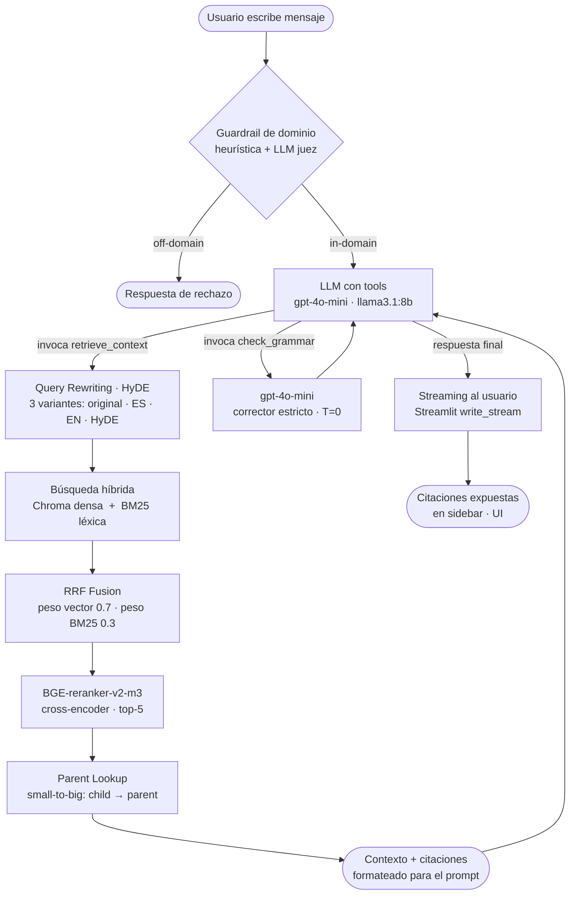
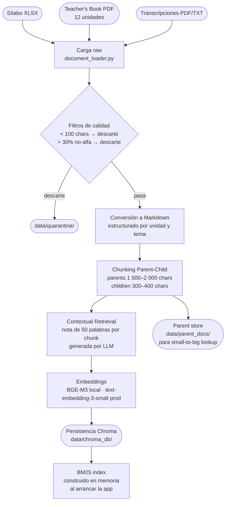

# LIA — Tutor Virtual de Inglés

**Proyecto de Innovación Tecnológica** · Maestría en IA Aplicada · Universidad Icesi, Cali, Colombia

#### -- Project Status: Active

---

## Equipo

**Instructor:** Luis Ferro Diez — [github.com/Ohtar10](https://github.com/Ohtar10)

| Integrante | GitHub | Correo |
|---|---|---|
| Farid Sandoval | [FaridSandoval](https://github.com/FaridSandoval) | farid.sandoval@icesi.edu.co |
| Ivan Moran | [IM-333](https://github.com/IM-333) | ivan.moran@icesi.edu.co |
| Josué Cobaleda | [josue-cobaleda](https://github.com/josue-cobaleda) | josue.cobaleda@icesi.edu.co |

**Contacto:** cualquier pregunta o interés en colaborar puede dirigirse al líder del equipo o al instructor.

---

## Objetivo

LIA (*Learning Intelligence Assistant*) es una tutora virtual conversacional para estudiantes del **Centro Cultural Colombo Americano de Cali** (ciclo Fundamental Plus, nivel A2–B1). Extiende la ventana de práctica lingüística fuera del aula mediante un sistema RAG anclado en los materiales pedagógicos oficiales de la institución, respetando estrictamente la metodología Communicative Language Teaching (CLT).

### Institución aliada

**Centro Cultural Colombo Americano** — Centro Binacional, Cali, Colombia
[www.colomboamericano.edu.co](https://www.colomboamericano.edu.co)

---

## Stack tecnológico

| Capa | Componente |
|---|---|
| **Frontend** | Streamlit |
| **Orquestación** | LangChain |
| **LLM — desarrollo local** | Ollama · `llama3.1:8b` |
| **LLM — producción / validación** | OpenAI `gpt-4o-mini` |
| **Embeddings — producción** | OpenAI `text-embedding-3-small` |
| **Embeddings — local** | BGE-M3 (`BAAI/bge-m3`) |
| **Reranker** | BGE-reranker-v2-m3 (`BAAI/bge-reranker-v2-m3`) |
| **Vector store** | Chroma (persistencia local en `data/chroma_db/`) |
| **Léxico** | BM25Okapi (rank-bm25, índice en memoria) |
| **Evaluación** | RAGAS · `gpt-4o-mini` como LLM juez |

---

## Métodos

- **RAG con consciencia curricular** — respuestas ancladas al sílabo Fundamental Plus
- **Búsqueda híbrida** — Chroma (densa) + BM25 (léxica) fusionadas con Reciprocal Rank Fusion
- **Contextual Retrieval** (Anthropic, sep 2024) — nota contextual de ~50 palabras por chunk generada por LLM en tiempo de ingesta
- **Chunking Parent-Child** — children recuperados, parents enviados al LLM (small-to-big)
- **Tool-calling agentic** — el LLM decide si y cuándo invocar `retrieve_context` y `check_grammar`
- **Guardrails** — clasificador de dominio (heurística + LLM juez) y filtro de baja confianza
- **Prompt engineering** — system prompt con política de idioma A2, corrección y formato estricto

---

## Fuentes de datos

| Fuente | Formato | Ruta |
|---|---|---|
| Sílabo institucional | XLSX | `data/raw/syllabus.xlsx` |
| Teacher's Book (12 unidades) | Markdown estructurado | `data/raw/book_te/` |
| Transcripciones de audio | PDF / TXT | `data/raw/supplementary/` |

---

## Pipeline de conversación

Desde que el usuario escribe hasta que recibe respuesta:



**Flujo agentic:** el LLM recibe el perfil del estudiante y el historial de conversación en el system prompt. Llama `retrieve_context` solo si necesita material del corpus, y `check_grammar` solo si detecta errores en el texto del estudiante. No hay retrieval forzado en cada turno.

---

## Pipeline de ingesta

Cómo entra la data cruda y sale el vectorstore listo:



**Nota:** el contexto generado por Contextual Retrieval se cachea en `data/contextual_cache/` para evitar llamadas repetidas al LLM durante re-indexaciones parciales.

---

## Puesta en marcha

### Prerrequisitos

- Python 3.11+
- [`uv`](https://github.com/astral-sh/uv) (gestor de paquetes)
- Clave de API de OpenAI (LLM + embeddings en producción)
- [Ollama](https://ollama.ai/) instalado (solo para ejecución local sin OpenAI)

### Instalación

```powershell
git clone https://github.com/FaridSandoval/LIA-Colombo-AI.git
cd LIA-Colombo-AI

uv venv
.venv\Scripts\activate
uv sync
```

### Variables de entorno (`.env`)

```env
OPENAI_API_KEY=sk-...

# Opcionales — los valores por defecto funcionan en producción
LLM_MODEL_NAME=gpt-4o-mini
LLM_TEMPERATURE=0.2
EMBEDDING_MODEL_NAME=text-embedding-3-small
ENABLE_RERANKER=false          # true solo si hay GPU o CPU potente (descarga ~1.1 GB)
ENABLE_CONTEXTUAL_RETRIEVAL=true
ENABLE_QUERY_REWRITING=true
```

Para ejecución **local con Ollama**:

```powershell
ollama pull llama3.1:8b

# Sobreescribir en .env:
LLM_MODEL_NAME=llama3.1:8b
LLM_UTILITY_MODEL=llama3.1:8b
```

### Ejecutar la app

```powershell
uv run streamlit run app.py
# → http://localhost:8501
```

### Re-indexar el corpus

```powershell
uv run python eval/reindex_now.py
```

---

## Estructura del repositorio

```
LIA-Colombo-AI/
├── app.py                    ← Aplicación Streamlit principal
├── pyproject.toml            ← Dependencias gestionadas con uv
├── data/
│   ├── raw/
│   │   ├── syllabus.xlsx     ← Sílabo institucional
│   │   ├── book_te/          ← Teacher's Book en Markdown (12 unidades)
│   │   └── supplementary/   ← Transcripciones de audio
│   ├── chroma_db/            ← Vectorstore persistente (Chroma)
│   ├── parent_docs/          ← Chunks padre para small-to-big lookup
│   ├── contextual_cache/     ← Cache de notas contextuales (Contextual Retrieval)
│   ├── user/                 ← Datos de estudiantes (XLSX)
│   └── quarantine/           ← Documentos excluidos del índice
├── src/
│   ├── config.py             ← Configuración centralizada y variables de entorno
│   ├── document_loader.py    ← Carga, filtrado, chunking y Contextual Retrieval
│   ├── embeddings.py         ← Modelo de embeddings y creación/carga del vectorstore
│   ├── retrieval.py          ← HybridRetriever, RRF, reranker, parent lookup
│   ├── guardrails.py         ← Guardrail de dominio y baja confianza
│   ├── llm_chain.py          ← LIAAgentPipeline: tool-calling loop + streaming
│   ├── prompts.py            ← System prompt, templates y GRAMMAR_CHECK_PROMPT
│   └── session_memory.py     ← Persistencia del historial de conversación (SQLite)
├── eval/
│   ├── golden_set.yaml       ← Dataset de evaluación manual
│   ├── run_ragas.py          ← Evaluación con RAGAS
│   └── reindex_now.py        ← Re-indexación manual del corpus
└── scripts/
    └── clean_book/           ← Utilidades de exploración y auditoría de PDFs
```
